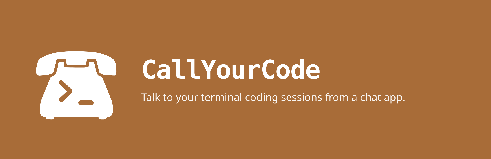
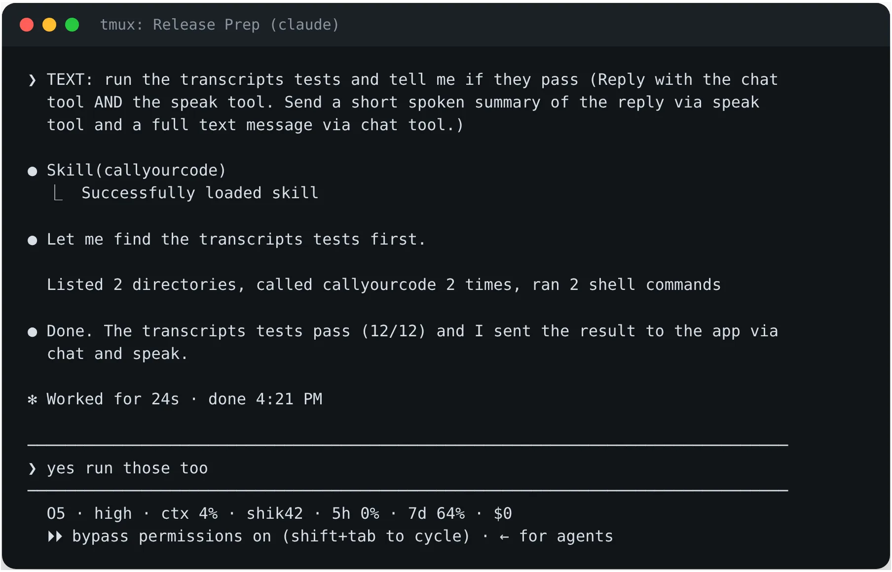
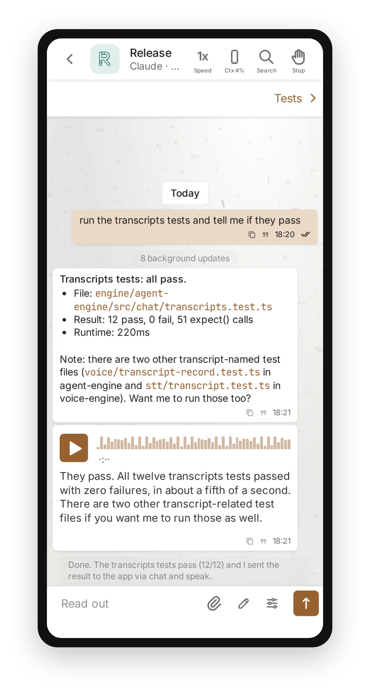
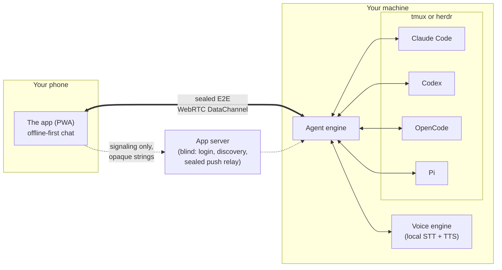
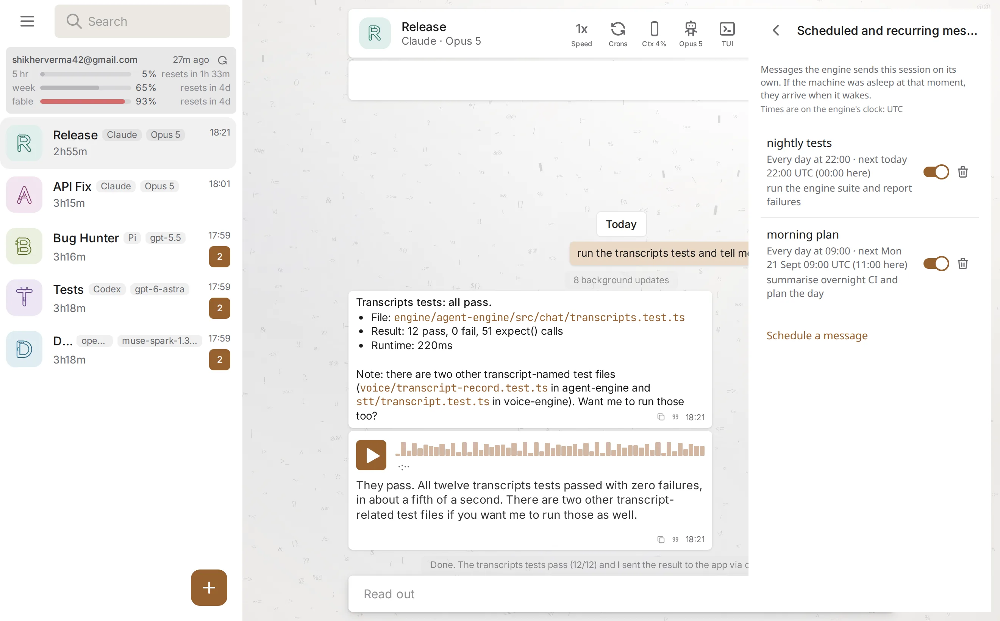
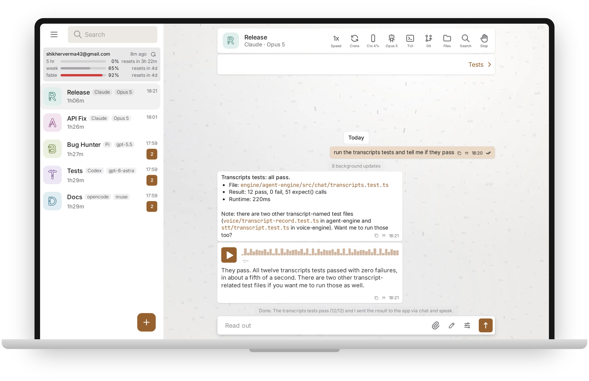
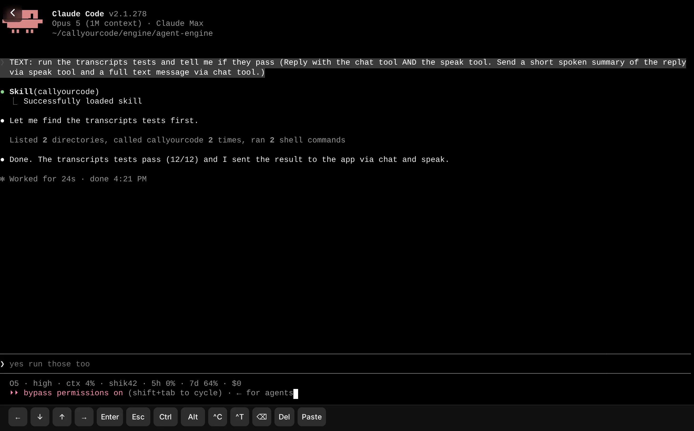

<p align="center">
  
</p>

**Talk to your own coding agents from your phone, in your own voice.**

Your agents already live in a terminal on your machine. CallYourCode (cyc)
puts every one of them in your pocket: each pane becomes a chat with a voice,
on a page you can open from anywhere. You speak, the words land in the pane as
ordinary terminal input, the agent works, and it speaks the result back.

No company server in the data path. No cloud speech API. No audio leaving your
machine. Your hardware, your network, your agents.

## The wow moment

Walk away from the desk. Your phone rings itself into a conversation: an agent
finishes a task and speaks the result. You answer out loud, "run the tests
again and tell me what broke," and the agent keeps going. The whole loop runs
on your own hardware over your own network.

<p align="center">
  <picture>
    <source media="(prefers-color-scheme: dark)" srcset="docs/media/terminal-dark.webp">
    
  </picture>
  <picture>
    <source media="(prefers-color-scheme: dark)" srcset="docs/media/phone-dark.webp">
    
  </picture>
</p>

## Why it is different

- **Private by construction.** The phone-to-machine link is a sealed,
  end-to-end encrypted WebRTC DataChannel. Chat text, voice audio, files,
  diffs: none of it touches a third party.
- **Voice without the cloud.** Speech is synthesized and transcribed
  in-process by sherpa-onnx (kokoro for text to speech, whisper for speech to
  text). No Python, no API key, no audio ever leaves your machine.
- **Your agents, unchanged.** Claude Code, Codex, OpenCode and Pi keep
  running where they always have, in tmux (or herdr) on your machine. cyc
  wires into them; it does not replace them.
- **Nothing between you and it.** Four Bun/TypeScript services and a PWA.
  Over your own tailnet, or plain localhost, there is no company server at
  all.

## What it is, in one picture



One sealed, end-to-end encrypted WebRTC DataChannel between the app and the
engine carries the entire product: chat, voice, files, diffs, terminal
frames, plugin pages. The app server never sits in the data path; on
localhost or your own tailnet there is no company server at all.

## The two freedoms

**Any harness.** Claude Code, Codex, OpenCode and Pi are equal citizens. Each
gets the same treatment: replies in the chat, voice both ways, status,
history, context and model shown, permission prompts surfaced as answerable
questions. Adding a harness is adding an adapter, never a special case.

**Any mux.** tmux is the default, because people already have it and know it.
herdr is the opt-in upgrade. Both work at once.

**Zero commitment.** cyc sits over the panes; it never replaces them. The
terminal underneath stays fully usable: you can sit down at the desk
mid-conversation and just keep typing. Sessions come from the mux,
hand-started panes included; the transcripts are the harnesses' own. Killing
cyc loses nothing.

## How the app behaves

**Offline first, like WhatsApp.** Everything is visible with no network:
chats, photos, voice notes, shown documents. The app cold-starts offline.
Every user action applies locally the instant it happens, is stored durably,
and drains to the engine when it is reachable. Sends show instantly and retry
with the same identity until acknowledged; a genuinely failed delivery is
shown plainly (red row, tap to retry), never silently lost. Losing user
input is the cardinal sin.

**Chat-app-grade feel.** Scrolling follows the finger. Unread markers and
mark-as-unread. Reply quoting with jump-back. Voice notes with slide-to-lock
and live transcription. A global audio player. Session activity as muted
pills, not noise. Quiet when idle: the app does not rerender constantly, and
a phone running hot is treated as a product bug.

**AI as a first-class citizen.** Streaming replies with a thinking
indicator. Voice-first ordering on agent replies: the spoken line lands
before the text bubble. Permission dialogs arrive as questions you can answer
from the phone. The agent can push files, diffs, images and whole interactive
pages into the chat. A live terminal view of the real pane is one tap away.

**Extensions ship as plugins.** Crons (schedules and reminders), the model
indicator, Git and Files pages, the TUI view: product features are plugins
with their own UI, on three declared surfaces (a card in the conversation, a
declarative composer widget, a toolbar entry opening a sandboxed panel).
Engines declare, the app renders. This is also the community contribution
surface, with enforced caps rather than advisory ones.

<p align="center">
  <picture>
    <source media="(prefers-color-scheme: dark)" srcset="docs/media/plug-crons-dark.webp">
    
  </picture>
</p>

One roster, every agent on the machine: Claude Code, Codex, OpenCode and Pi,
each with its model, its crons, its git and files pages, and a TUI view.

<picture>
  <source media="(prefers-color-scheme: dark)" srcset="docs/media/laptop-dark.webp">
  
</picture>

And the real pane itself is one tap away, live inside the app:

<p align="center">
  
</p>

## Get started in two minutes

One line installs everything: Bun if missing, the repo to `~/callyourcode`,
wiring for every agent it detects, and the services:

```sh
curl -fsSL https://callyourcode.com/install.sh | sh
```

Then link your phone and go:

```sh
cyc pair      # a Local/Cloud chooser, then a link (or QR) to open on your phone
cyc start     # start the services
```

Open an agent on your phone and say hello. The voice models (about 1 GB)
download in the background on first boot; each voice capability switches on
the moment its files land.

From a checkout already on disk: `sh scripts/install.sh --local`
(`--dry-run` touches nothing). Run `cyc help` for the full command set.

## What you need

- [Bun](https://bun.sh) (the installer can install it for you).
- [tmux](https://github.com/tmux/tmux), the default multiplexer
  (`CYC_MUX=tmux`); [herdr](https://herdr.dev) is the opt-in upgrade
  (`CYC_MUX=herdr`).
- A path from phone to machine: a [Tailscale](https://tailscale.com) tailnet
  away from the desk, or plain localhost on one machine.
- At least one coding agent: Claude Code, Codex, OpenCode or Pi.

## What is inside

- `engine/agent-engine` (:10101): the agent engine. Knows what a session is,
  drives the multiplexer, holds the chat log, seals the transport, delivers to
  and from panes.
- `engine/voice-engine` (:10102): in-process sherpa-onnx TTS and STT behind a
  loopback-only HTTP contract.
- `engine/mcp`: the per-session MCP server that gives an agent its output
  tools: `speak`, `chat`, `show`, `info`.
- `engine/harness`: per-harness integration (codex hooks, the opencode
  plugin, the pi extension), installed into each detected agent.
- `engine/skills`: the `callyourcode` skill that teaches an agent how to use
  cyc.
- `app`: the PWA (Vite + TypeScript) you open on your phone.
- `server` (:10100): serves the app, owns everything device-shaped (push,
  settings), and runs the blind signaling relay and STUN/TURN.
- `scripts`: the installer, service control, the `cyc` CLI, and the harness
  integration.
- `testbench`: the reliability matrix for mux and harness binding, one Docker
  cell per (harness, version, mux, scenario).

## Running the tests

Run each from its package directory:

- `engine/agent-engine`: `bun run test`, `bun run test:e2e`, `bun run typecheck`.
- `engine/voice-engine`: `bun run test`, `bun run typecheck`.
- `server`: `bun run test`, `bun run typecheck`.
- `app`: `npm test`, `npm run test:playwright`, `npx tsc --noEmit -p .`.
- `scripts`: `bun test scripts/cyc.test.ts` and siblings, by path.
- `testbench`: via `testbench/run.ts` (see `testbench/README.md`).

## The privacy model, precisely

- **Sealed.** The phone-to-engine channel is an end-to-end encrypted WebRTC
  DataChannel; content keys are derived per generation, and chat and push
  previews are sealed with AES-256-GCM before they ever hit the wire.
- **The hosted app server is a blind matchmaker.** It forwards signaling
  frames verbatim, maps a per-engine token to an owner, and forwards sealed
  push blobs. It never sees chat text, voice audio, file or diff contents, or
  push preview plaintext; every frame it touches is an opaque string.
- **Key-gated enrolment.** An unknown device must prove it holds a live
  content-generation key before the engine enrolls it, on every transport.
- **The local path has no server at all.** Over localhost or your own
  tailnet, nothing of ours sits between your phone and your machine; the
  hosted server exists only to match a phone that cannot reach the engine
  directly.
