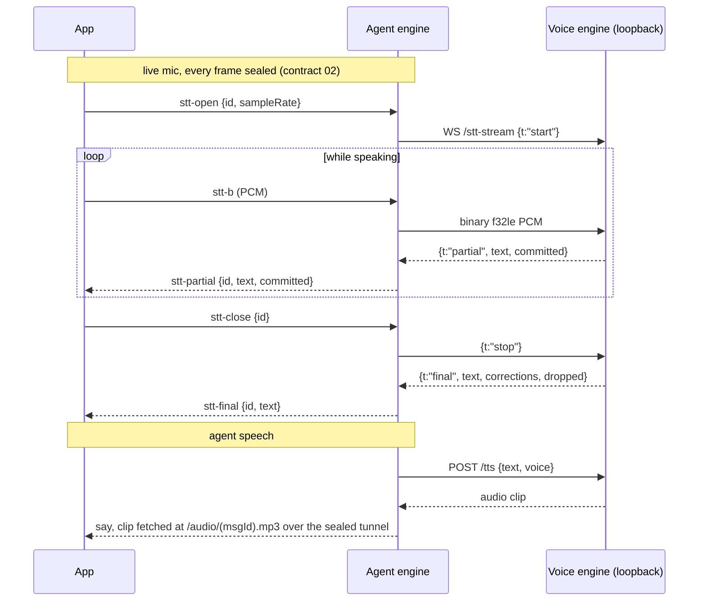

# 01. Agent engine <> voice engine

## Purpose

Voice never leaves the machine (PRODUCT.md section 4): STT and TTS are
in-process sherpa-onnx (whisper + kokoro), no Python, no cloud. The voice
engine is pure speech with zero session knowledge; the agent engine is its
only network-facing front. One voice engine runs per speaking machine.

## Parties and transport

- voice engine: `engine/voice-engine/src/server.ts`, binds `127.0.0.1:10102`
  (VOICE_PORT/VOICE_HOST). A non-loopback VOICE_HOST refuses to boot.
- agent engine: dials it over loopback HTTP/WS. `VOICE_URL` may list several
  engines comma-separated, preferred first; a 30s-sticky health probe picks
  one (`src/voice/voice-proxy.ts voiceUrl()`).
- The app never dials the voice engine. It reaches voice through its agent
  engine only.

## Voice engine routes (normative: `server.ts` header + handlers)

- `POST /stt` audio bytes -> `{text, corrections, dropped, mode?, timing}`.
  Batch whisper with broken-container salvage and a BatchGate concurrency cap
  (`BATCH_MAX`, default 3); a request that cannot get a slot within
  `BATCH_QUEUE_WAIT_MS` answers 503. `dropped` non-empty means the whole text
  was one of whisper's stock hallucinations and was refused; `text` is then "".
  `?offset=<seconds>` decodes ONLY the tail past that point, so the engine
  never re-decodes audio the device's streaming decoder already settled.
- `WS /stt-stream`: `{t:"start", sampleRate}` (16000 only) + binary f32le mono
  PCM frames + `{t:"stop"}` -> a stream of `{t:"partial", text, committed,
  committedS?}` then ONE terminal `{t:"final", text, corrections, dropped}` or
  `{t:"error", message}`. Partials are emulated over batch whisper.
- `POST /tts` `{text, voice?, stream?, pcm?}` -> audio; `pcm:true` answers raw
  PCM with `x-pcm-rate` (kokoro is 24000; the caller never hardcodes it).
- `GET /voices` -> `{voices: string[], current}` (`current` = the active
  kokoro voice).
- `GET /health` -> `{ok, degraded, selfcheck, load, capabilities, vocabulary}`:
  per-capability readiness plus MEASURED throughput and load, backed by a real
  TTS+STT self-check round trip. This is the seed of multi-engine selection.

## The request gate (normative: `gate.ts`)

The voice engine has no auth by design; its security is "only this machine can
reach it", enforced two ways. The loopback bind is asserted at boot. Then
`gate.ts` runs at the top of `handleHttp` for EVERY request, the `/stt-stream`
upgrade included, and refuses any that is not from a true local caller:

1. non-loopback peer -> refused (missing peer fails closed);
2. `x-forwarded-for` present -> refused (its presence marks a forwarded
   request; never read as a credential);
3. `Host` not a loopback name -> refused (DNS-rebinding residual);
4. `Origin` present and not the engine's own test-bench origin -> refused.

A server-side caller (the agent engine's loopback fetch/WebSocket) sends no
Origin and no `x-forwarded-for` and so passes; a browser page other than the
engine's own `/test.html` cannot.

## How voice reaches the app

1. **Batch STT and TTS** ride the agent engine's own origin as `/voice/stt`,
   `/voice/tts`, `/voice/voices` (proxied to VOICE_URL, `voice-proxy.ts`),
   which the app reaches over the sealed tunnel like any other engine route
   (`app/src/engine/client.ts`).
2. **The live mic stream** rides the sealed DataChannel as `stt-open`,
   `stt-b`, `stt-close` client frames, bridged engine-side to `/stt-stream`
   over loopback; `stt-partial`, `stt-final`, `stt-error` ride back sealed
   under the same id. The frame-for-frame wire contract is the comment block
   in `voice-proxy.ts`. Every opened id ends in exactly one terminal frame
   unless the client connection dies first.
3. **Agent speech** is synthesized engine-side (`voice/tts.ts`) and delivered
   as a `say` clip the app fetches at `/audio/<msgId>.mp3` over the sealed
   tunnel, voice-first ordering handled app-side.

## Voice readiness frame

The engine broadcasts a `voice` frame (`sessions-frame.ts voiceFrame`):
`{t:"voice", url, healthy, ready:{stt, tts}, download?}`. `healthy` is the
all-or-none unit; `ready` reports each capability on its own (models download
independently: kokoro lands before whisper); `download` names a capability
still fetching with a percent hint. The app consumes `healthy` to enable or
disable voice affordances (`app/src/engine/frames/engine.ts` `voice` handler).

## WebRTC media track (dormant)

`voice/voice-media.ts` and the app's `RtcDial withAudio` path define an Opus
media-track lane for call mode, but it is not wired live: the engine's werift
transport never reciprocates a track (`transport/rtc.ts`, `track` stays null)
and the app dials `withAudio=false` (`client.ts`), so `hasVoiceMedia()` is
always false and call mode rides the sealed stt-* stream (path 2). The lane is
kept as the seam for a real-time-audio upgrade.

## Failure semantics

- Voice engine down: `/voice/*` proxies fail at connect; the stt bridge
  answers `stt-error` (connect backstop `voiceProxyTimeouts.wsConnect`, 5s);
  an upstream close without a final is `stt-error`, never silence.
- The `voice` frame's `healthy` and per-capability `ready` flip independently
  while models download; the app disables voice affordances, nothing else
  breaks.
- Self-check failure makes the voice engine EXIT and lets the supervisor
  respawn (the standard recovery pattern).
- Bounded everything: decode timeout, batch slots, buffered-PCM caps on both
  bridge sides (`STT_BRIDGE_BUFFER_MAX` mirrors the voice engine's own cap).

## Security invariants

- The voice engine is never reachable off-machine: loopback bind asserted,
  every request gated, no auth to leak because no remote caller exists.
- Mic audio and transcripts cross app <-> engine ONLY inside the sealed
  channel; a WS upgrade cannot carry the sealed-tunnel mark, and the gate
  refuses any browser page but the engine's own test bench.
- No audio or transcript ever touches the app server.
