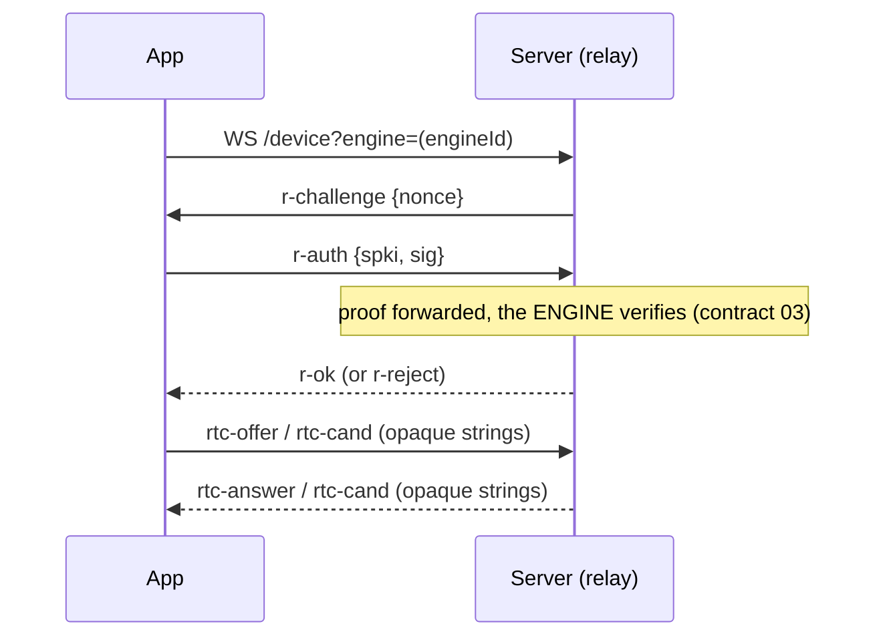

# 04. Server <> app

## Purpose

The app server serves the page and owns everything device-shaped: the
bootstrap config, login (HOSTED), push subscriptions, and the device half of
signaling (PRODUCT.md section 4: login, engine discovery, notifications, and
nothing else). Same origin as the page, so no CORS dance and no key
distribution problem.

## Parties and transport

- server: `server/src/bootstrap/server.ts` (:10100) and `routes/*`.
- app: same-origin fetches (`app/src/engine/appFetch.ts` attaches the Clerk
  session in HOSTED, nothing in LOCAL) plus one WS per signaling attempt.

## `GET /config` (normative: `routes/config.ts`; app decoder `contract.ts loadAppConfig` / AppConfig)

The page bootstrap, public.
- `engines`: ANNOUNCE-ONLY `{url, engineId, host, user}` entries from the live
  lease list; owner-scoped in HOSTED (empty without a session). The app builds
  the handshake's `user@host` from it and matches a pairing URL's
  `?engine=<engineId>`. An entry may be a plain URL string or an object;
  `normalizeEngine` accepts both.
- `auth`: `"clerk" | "none"` (+ `clerkPublishableKey` in HOSTED).
- `rtc.iceServers`: LOCAL emits the local turn-server block (or empty); HOSTED
  emits STUN for everyone plus per-owner TURN creds for an authenticated
  caller. Signaling URLs are NOT served: the app derives
  `wss://<page-origin>/device?engine=<id>` from its own origin.
- `voice`, `voiceLabel`, `voiceBases`: served but not read by the app (voice
  rides the engine's own origin, contract 01).

The app caches the config in localStorage and boots offline from the cache.

## Signaling `/device?engine=<engineId>` (one WS per attempt)

HOSTED requires a Clerk session AND that the session's owner owns that engine
(403 otherwise); LOCAL is open. Over the socket the relay first challenges the
device key: `r-challenge {nonce}` -> `r-auth {spki, sig}` -> `r-ok` or
`r-reject` (`app/src/engine/rtc.ts wsSignal`; the ENGINE verifies, the relay
stays blind). Then rtc-offer/answer/cand/fail flow verbatim as opaque strings
(contract 05).

## Push, device side (`routes/push.ts`)

`GET /push/key` (VAPID public), `POST /push/subscribe {subscription, label,
deviceId, test?}`, `/push/unsubscribe`, `/push/devices`,
`POST /push/read {sessionId}` (joins the outgoing dismiss window),
`/push/shown` (telemetry), `/push/test`. All owner-gated in HOSTED via the
Clerk session (`owners.deviceOwner`).

## Onboarding (`onboarding/onboard.ts`)

`/enroll` page + `/enroll/grant` (Clerk-gated one-time `cyg_` mint) +
`/enroll/device` device flow the engine's `cyc pair` polls (contract 03).

## Also

`/clientlog` (app log lines land beside engine.log, greppable on one cid),
`/report` + `/reports` (bug reports), `/settings`, static dist with CSP
headers (`platform/static.ts`), 320MB proxy body cap (`maxRequestBodySize`)
matching the engine's.

## Failure semantics

- Server down: the page cold-starts from the service-worker precache and the
  cached config; engines still connect (LOCAL signaling is same-box; an
  already-open DataChannel never depended on the server). New signaling
  attempts fail until it returns; the sync manager backs off.
- HOSTED without VAPID keys refuses to boot loudly rather than serving a
  half-working push (`bootstrap/server.ts`).
- A wrong engineId on /device answers a ws close code, never an enumerable
  HTTP error; revoke answers 404 for someone else's engine, never 403.

## Security invariants

- The server can never read content: it stores push endpoints and settings,
  forwards sealed blobs and opaque signaling strings, and holds no E2E key
  material. The pairing key rides only in a URL #fragment, which never reaches
  this server (`pairkey.ts`).
- HOSTED scoping is absolute: engine lists, TURN creds, push stores and
  signaling are all keyed by the verified Clerk sub; nothing accepts an owner
  from a request body.
- Rate caps guard every engine-driven surface (per-engine push rate, batch
  item caps) and the enroll endpoints; caps live in `platform/caps.ts`.
- Client logs ship to THIS server only, and only because the same owner runs
  it; nothing leaves the deployment.
