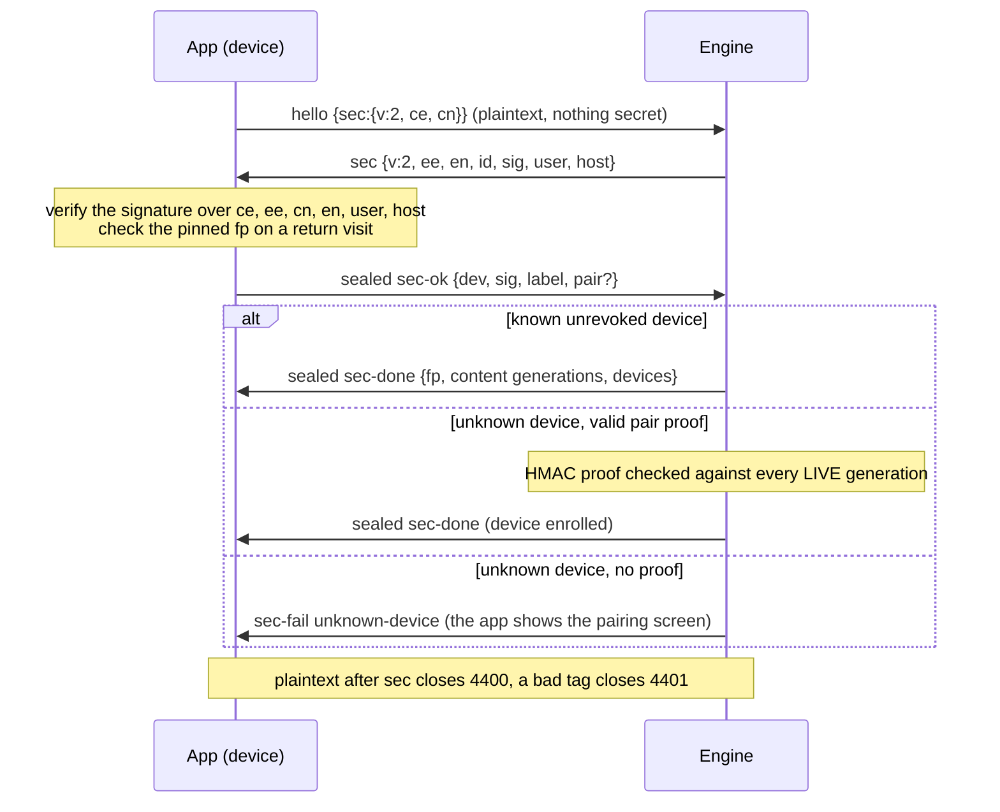

# 06. End-to-end encryption

## Purpose

"Its end to end encrypted with the encryption key going out of band... the
server can never read the data" (PRODUCT.md). The design excludes the app
server from trust entirely: content keys move engine-to-device out of band,
the wire is sealed per connection, enrolment is key-gated on every transport,
and push previews are sealed under keys the server never holds.

## Parties and transport

- crypto core: `engine/shared/e2e.ts`, imported by both the engine and the app
  via `@shared/e2e`, pinned by `engine/shared/fixtures/e2e-vectors.json`.
- engine state: `engine/agent-engine/src/security/sec.ts` (keys.json v3:
  engineId, ECDSA P-256 identity, content generations, device list; 0600,
  atomic writes).
- app state: device identity + pins in `app/src/engine/identity.ts`, content
  keys in IndexedDB `cyc-keys` (`keyring.ts`), non-extractable HKDF form.

## Primitives (normative: `e2e.ts` + vectors)

HKDF-SHA256, AES-256-GCM, HMAC-SHA256, ECDSA/ECDH P-256. Frame keys per
connection per direction (`deriveFrameKey(kRoot, "c2e"|"e2c", cn, en)`);
deterministic counter IVs (`dir:` + u64be n, never sent); `FrameReceiver`
refuses any non-increasing `n` (in-connection replay protection, serialized
opens); sealed frame shape `SealedFrame {t:"x", n, ct}`.

## Handshake (every new pipe)

Engine: `sec.ts EngineSecConn.feed`; app: `client.ts handshake`.

1. app -> `hello {sec:{v:2, ce, cn}}` (plaintext, nothing secret).
2. engine -> `sec {v:2, ee, en, id: spki, sig, user, host}`; the signature
   binds ce|ee|cn|en AND user/host (`secTranscript("e", ...)`) so an in-path
   relay cannot relabel the engine.
3. app verifies the sig, checks the PINNED fp on a return visit (a changed
   identity throws and holds the client with an explicit sheet, never
   auto-trust), derives the channel, and answers sealed
   `sec-ok {dev: spki, sig, label, pair?}`; the device signs
   `secTranscript("c", ..., id)` binding the engine's identity (no
   unknown-key-share).
4. engine: known unrevoked device -> proceed. UNKNOWN device -> enrol ONLY
   when `pair` verifies: HMAC over SHA-256(transcript) keyed by
   `derivePairKey(contentKey)` against every LIVE generation
   (`verifyPairProof`). No proof: `sec-fail unknown-device`, and the app shows
   the pairing screen. Key-gated on EVERY transport, loopback included.
5. engine -> sealed `sec-done {fp, dev, paired, content:[{gen, kid, key}],
   devices:[...]}`; the app stores every live generation under `user@host`
   (`keyring.ts storeGenerations`), then the sealed hello burst flows.

Anything plaintext after `sec` closes 4400; a bad tag closes 4401. A bare
`hello` client is told `sec-required {v:2, fp, user, host}` to reconnect
with `sec`.

## The out-of-band key

base64url of the newest live generation's 32 random bytes, shown by `cyc pair`
(`security/pairkey.ts`) as text + QR + a link
`<APP_URL>/?engine=<engineId>#pair=<key>` carrying it ONLY in the URL
#fragment, so it never hits a wire, a log, a Referer, or callyourcode.com.

## Derived keys (domain-separated by HKDF info)

`auth`, `c2e`/`e2c`, `session:<id>` (push previews per chat), `notify`
(engine-level pushes), `pair`, `blob` (at-rest sealing, `CYB2 | gen | iv |
ct`). `kid` = first 8 bytes of SHA-256(kEngine), base64url; rides plaintext so
a multi-engine device picks the right stored key. Generations rotate
additively; HKDF is one-way so no derived key climbs back to the root, and a
new derivation gets a new info string that cannot collide with an existing
one. keys.json is `v:3`; a file at any other version is backed up and
regenerated, never half-trusted.

## Failure semantics

- `sec-fail unknown-device` holds the client for pairing (no retry storm); a
  changed engine identity holds it for an explicit user decision (`trustEngine`
  wipes the pin and stored key first).
- Revoked device: refused at handshake AND at the relay dial
  (`verifyRelayAuth`).
- A failed decrypt/replay kills the connection, never skips a frame.

## Security invariants

- The pairing key and every content key never touch the app server; the
  fragment rule is load-bearing.
- The device private key is non-extractable and never leaves the browser; the
  engine's identity key never leaves keys.json (0600).
- Frame keys are per-connection (fresh nonces): a captured frame is garbage on
  the next connection.
- There is no unsealed mode and no downgrade path: no HTTP cap or bearer
  exists, and push previews with no seal are DROPPED engine-side, not sent
  plaintext (contract 07).
