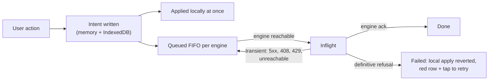

# 10. App <> UI (store, render, intents)

## Purpose

"Behave like an offline first chat application, like whatsapp... not
rerendering constantly. offline first meaning that the data is visible even if
the network goes away" (PRODUCT.md). Inside the app that promise is a
boundary: the engine store is the ONE state authority, the UI is a pure
consumer painting only what changed, and every user action is a durable intent
applied locally first. Losing user input is the cardinal sin.

## Parties and transport

In-process seams inside `app/src`:
- store: `engine/store.ts` (+ `engine/store/registry.ts` for Conn/session
  maps, `engine/store/handlers/*` for inbound frames) over per-engine
  WsEngineClients.
- persistence: IndexedDB stores (`engine/history.ts` chat pages,
  `engine/intents.ts` queue via the cyc-clips `intents` store,
  `engine/showVault.ts` docs, `audio/audioCache.ts` clips, `engine/keyring.ts`
  keys) plus the service-worker precache for the shell (`swBoot.ts`,
  `public/cyc-sw.js`).
- render: `renderHub.ts` (the one render pass), `storeBindings.ts` (store
  events -> hub + navigation), `sessionState.ts` (view state).
- connectivity words: `engine/sync/connection.ts` (the ONE state machine per
  engine the UI ever hears about).

## Store authority

UI code never talks to a client or the wire directly; it calls store verbs
(send, rename, reorder, markUnread, settings, attach) and subscribes to store
notifications. The store merges every engine's roster into one list + tabs,
keys sessions by engine + id, and owns dedupe (`dedupeCap.ts`, `mid`-based row
identity).

## Durable intents (normative: the header block of `engine/intents.ts`)

Every user mutation is an `Intent {id, engineKey, sessionId?, kind,
coalesceKey?, payload, createdAt, attempts, wireWrites?, state, lastError?}`
with `IntentKind` one of send-text / send-voice / send-files / rename /
reorder / mark-unread / heard / progress / session-settings / global-settings,
and `IntentState` queued / inflight / failed. Written to memory + IndexedDB the
moment the user acts, applied locally at once, drained FIFO per engine by
`sync/drain.ts` when reachable. Latest-wins kinds coalesce into their queued
row (keeping queue position); sends NEVER coalesce. Nothing is dropped for
being old; nothing is failed for a transient reason (a 5xx, 408, 429, or
unreachable engine keeps the row queued). ONLY a definitive engine answer (any
other 4xx, or an explicit nack) fails an intent, and then the local apply is
reverted and the row shows red + retry.

## Recordings

A voice capture is vaulted before anything else
(`features/composer/persistence/vault.ts`,
`features/composer/voice/recordingLedger.ts`); a reload recovers the vault.
Uploads go chunked + resumable through `/transfer/*` with sha256 identity
(`engine/transfers/worker.ts`), so a flaky network resumes instead of losing
bytes.

## Render discipline

Store changes coalesce into ONE hub render; each surface (tabs, list, chat)
computes a version string and paints ONLY when its version changed
(`renderHub.ts paintSurface`; contentVersion memoized per pass). A phone
running hot from renders is a product bug; the `render.skipped` counters and
`__cycRenderCount` are the proof hooks. `stream-rerender.spec.ts` /
`render-storm.spec.ts` gate it.

## Connectivity words

The UI sees exactly `offline | connecting | syncing | live` (`SyncStatus`),
derived from the per-engine machine idle / dialing / sealed / settled /
draining / live / down. The manager owns backoff (`BACKOFF_BASE_MS` 1s ..
`BACKOFF_CAP_MS` 30s), stops dialing `HIDDEN_STOP_MS` (30s) after hide, and
pokes on visible / online / intent / open-chat. Clients dial only when told
(`redialNow`). Dead engines keep their data; history renders from IndexedDB
while down.

## Boot

Cold-start offline from the precache + cached config + IndexedDB; paint
restored state first, reconcile when engines settle (`bootgate`,
`offline-cold-open` specs). Attach on the settled edge with `have` so matching
tails replay nothing.

## Absorbing wire evolution

The store absorbs wire evolution so the UI never sees it: unknown session
event kinds are held un-painted, absent optional fields get defaults, and
capability-gated affordances (voice, words, dials) follow `client.can` and the
settings the engine actually served.

## Failure semantics

- Engine unreachable: every verb still "works" locally (intent queued), sends
  show queued state, media falls back to caches; `EngineOffline` fetches wait
  for the reseal grace before failing (`whenEngineReady`).
- Intent revert on definitive refusal restores the pre-apply value and
  surfaces the reason; send rows offer tap-to-retry with the SAME cid.
- IndexedDB unavailable (private mode): the app still runs this-session with
  memory state; persistence quietly degrades.

## Security invariants

- All local persistence is origin-locked browser storage; app logs ship only
  to the owner's own app server (`/clientlog`) and nowhere else.
- The UI never holds key material; crypto stays inside engine/e2e + keyring,
  and rendering plugin/show content happens in sandboxed frames (contract 08).
